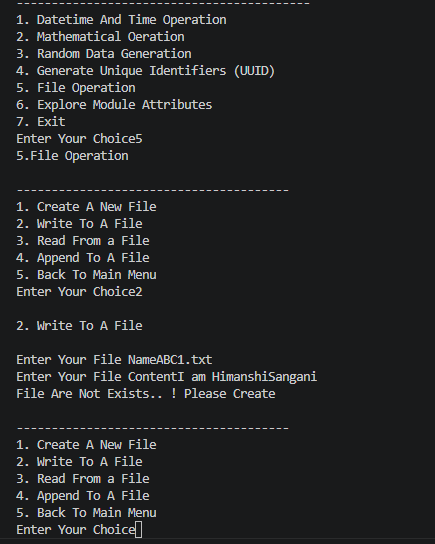
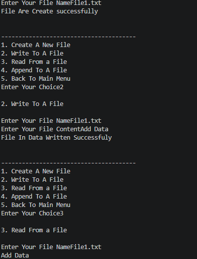
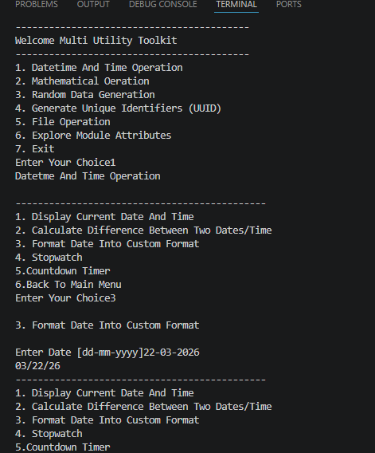
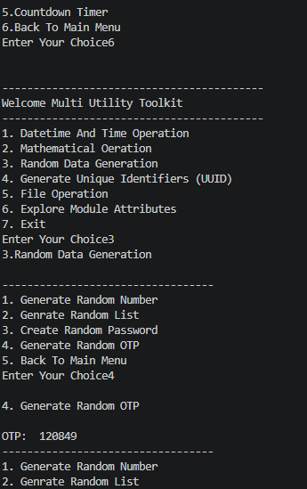
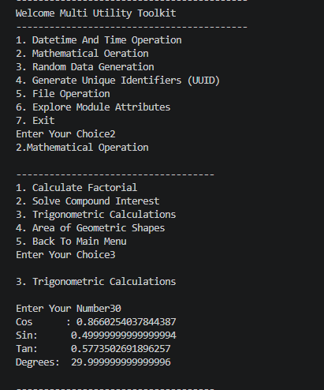
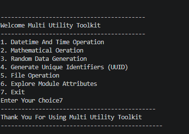

#  Multi Utility Toolkit

A  provides **multiple utilities** in one place, including Date & Time Operations, Mathematical Calculations, Random Data Generation, UUID Generation, File Handling, and Module Exploration.

##  Technologies Used

- datetime
- time
- math
- random
- string
- uuid
- File Handling

---

##  Learning Objectives

```
This project demonstrates:

- Functions
- Loops
- Match-Case Statements
- Exception Handling
- File Handling
- Date & Time Operations
- Mathematical Calculations
- Random Module Usage
- UUID Generation
- Modular Programming


```







## Future Improvements

- Better Input Validation
- Improved User Interface

---
## Conclusion
The **multiple utilities** project provides practical experience with Python file handling, exception handling, Programming and many  concepts
